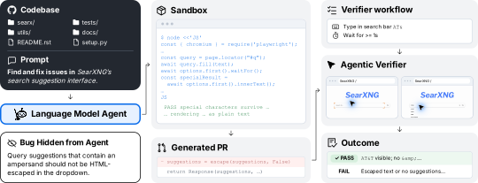
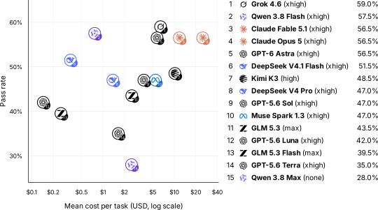
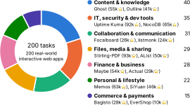

<div align="center">

# 🧹 SWEeper-Bench

### Can Agents Discover Bugs in Interactive Software?

Yang Yao<sup>1\*</sup> &nbsp;·&nbsp; Haozhe Chen<sup>1\*</sup> &nbsp;·&nbsp; Bingyi Kang &nbsp;·&nbsp; Karthik R Narasimhan<sup>1</sup> &nbsp;·&nbsp; Zhuang Liu<sup>1</sup>

<sup>1</sup>Princeton University &nbsp;&nbsp;&nbsp; <sup>\*</sup>Equal contribution

<!-- TODO: add the paper and blog post links -->
[]()
[]()
[](https://huggingface.co/datasets/EVIGBYEN/SWEeper-Bench)
[](https://huggingface.co/datasets/EVIGBYEN/SWEeper-Bench-traces)
[](https://github.com/zlab-princeton/sweeper-bench/tree/leaderboard)

</div>

**SWEeper-Bench** tests whether coding agents can find and fix bugs that nobody has reported yet. It has **200 tasks**, each built from a real bug fix in a different open-source web app. The agent gets the codebase and an open-ended request such as *"Find and fix issues in SearXNG's search suggestion interface."* It is not told what the bug is. The bugs only appear after a sequence of normal user actions, so the agent has to run the app and test it. An agentic verifier then checks the patch in a browser, the way a user would.

<p align="center">
  
</p>

<p align="center">
  <a href="#-setup">Setup</a> ·
  <a href="#-quickstart">Quickstart</a> ·
  <a href="#-how-a-case-runs">How a case runs</a> ·
  <a href="#-documentation">Docs</a> ·
  <a href="#-leaderboard">Leaderboard</a> ·
  <a href="#-citation">Citation</a>
</p>

## 🔧 Setup

All apps and agents run in [Modal](https://modal.com) cloud VMs. You don't need local Docker or a GPU. You need:

| Requirement | Used for |
|---|---|
| Python ≥ 3.11.4 and Git | Running the CLI on your machine |
| [Modal](https://modal.com) account | VMs that run the apps, the agent, and the verifier |
| [Hugging Face](https://huggingface.co/settings/tokens) token | Downloading the task dataset |
| GitHub token with `read:packages` | Pulling the prebuilt app and agent images from GHCR |
| A model provider key, e.g. `OPENAI_API_KEY` | The coding agent and the verifier |

**1. Install.**

```bash
git clone https://github.com/zlab-princeton/sweeper-bench.git
cd sweeper-bench
python3 -m venv .venv && source .venv/bin/activate
pip install -r requirements.txt
cp configs/config.toml.example configs/config.toml
```

**2. Connect your accounts.** Keep credentials in the environment and out of `configs/config.toml`, because the runner copies the config into every run directory.

```bash
modal token new
export HF_TOKEN=hf_...
export GHCR_USER=your-github-username
export GHCR_TOKEN=ghp_...          # needs read:packages
export OPENAI_API_KEY=sk-...
```

The default config runs **Codex on the official OpenAI API**. `gpt-6-astra` fixes the bug and `gpt-5.6-luna` verifies the fix. You pay for Modal and model usage.

## 🚀 Quickstart

**Run one case.** This command runs the agent on task `sweeper-001` and then verifies its patch.

```bash
python scripts/run.py --cases sweeper-001 --run-dir runs/first
```

**Read the result.**

```bash
python scripts/run.py status --run-dir runs/first
cat runs/first/evaluations/sweeper-001/artifacts/logs/prediction-scoped-result.json
```

The verifier reports two behavior tests, and each one is `pass`, `fail`, or `uncertain`:

- **target**: the bug is fixed and the feature now works as intended.
- **preservation**: nearby behavior still works.

A task counts as solved only if **both pass**.

**Run more cases.**

```bash
python scripts/run.py --cases sweeper-001 sweeper-002 --run-dir runs/batch  # a few cases
python scripts/run.py --cases-file my-cases.txt --run-dir runs/batch        # IDs from a file
python scripts/run.py --all --run-dir runs/full                             # all 200 cases
python scripts/run.py --all --run-dir runs/full --resume                    # pick up where it stopped
```

**Run the two stages separately.** For example, you can verify old patches again with a new verifier.

```bash
python scripts/run.py predict  --cases sweeper-001 --run-dir runs/pred
python scripts/run.py evaluate --cases sweeper-001 --predictions runs/pred --run-dir runs/eval
```

**Evaluate a different agent.** Change the `[prediction]` section and add an account with the same harness. For example, Claude Code:

```toml
[prediction]
harness  = "claude-code"
provider = "anthropic"
model    = "claude-fable-5-1"
accounts = ["claude"]

[accounts.claude]
harness     = "claude-code"
auth        = "api"            # reads ANTHROPIC_API_KEY
concurrency = 5                # number of VMs to run in parallel
```

| Harness | `provider` | Key |
|---|---|---|
| `codex` | `openai` | `OPENAI_API_KEY`, or a ChatGPT subscription |
| `claude-code` | `anthropic` | `ANTHROPIC_API_KEY`, or a Claude subscription token |
| `cursor` | `cursor` | `CURSOR_API_KEY` |
| `kimi-code` | `kimi` | `KIMI_API_KEY` |
| `gemini-cli` | `gemini` | `GEMINI_API_KEY` |
| `deepseek-harness` | `deepseek` | `DEEPSEEK_API_KEY` |
| `muse-code` | `meta` | `META_API_KEY` |

For subscription logins, multiple accounts, and the browser-use verifier, see [Agents](docs/agents.md).

## 🔍 How a case runs

1. **Load the task.** The runner downloads one task from the [dataset](https://huggingface.co/datasets/EVIGBYEN/SWEeper-Bench). A task contains the app's repository and buggy commit, the prompt for the agent, and two hidden behavior tests.
2. **Start the app.** A Modal VM pulls the app's prebuilt image, checks out the buggy commit, and serves the app on `127.0.0.1:13200`.
3. **Let the agent work.** The coding agent runs in its own container with the source code at `/workspace/product`. It gets only the prompt. It never sees the behavior tests, the bug description, or the reference fix. It can run the app and drive it with Playwright, and its network can reach only model provider APIs.
4. **Collect the patch.** When the agent exits, its code changes are saved as `prediction-scoped.patch`.
5. **Verify.** A new VM starts a clean copy of the app and applies the patch. An agentic verifier then runs the **target** and **preservation** tests in a real browser. Both results are saved separately.

The main settings for a run are in `configs/config.toml`:

| Setting | Options | What it changes |
|---|---|---|
| `prediction.level` | **`scoped`** · `specified` | `scoped` names only a product area. `specified` describes the bug, which turns the task into ordinary bug fixing. |
| `prediction.prompt_templates` | **`browser`** · `non-browser` | `browser` tells the agent to test the app in a browser like a real user. `non-browser` drops that instruction. |
| `prediction.time_budget` | **`"unlimited"`** · minutes | Gives the agent a deadline and tells it to keep working until then. Codex and Claude Code only. |
| `evaluation.phases` | **`["prediction"]`** · `baseline` · `reference` | Choose what to verify: the agent's patch, the unmodified buggy app, or your own reference patch. |

Defaults are in **bold**. Each run saves the agent's patch, its full trajectory, the verifier's logs, and optional browser videos under `runs/<name>/`.

## 📚 Documentation

| Doc | Read it for |
|---|---|
| [**Guide**](docs/guide.md) | Every config option, the run directory layout, case statuses, resuming and recovering runs, time budgets |
| [**Agents**](docs/agents.md) | Setup for each harness, API keys and subscriptions, mixing models and accounts, the two verifiers |
| [**Design**](docs/design.md) | Pipeline internals, retries, what the sandbox does and does not enforce, code map |
| [**Manual walkthrough**](docs/manual-walkthrough.md) | Running one case by hand on Modal without this runner |

## 🏆 Leaderboard

The best of 15 frontier agents passes only **59.0%** of tasks. If you give agents a description of the bug, they pass about 96%. Finding the bug is the hard part, not fixing it.

<p align="center">
  
</p>

The [full leaderboard](https://github.com/zlab-princeton/sweeper-bench/tree/leaderboard) has per-task results for every agent and the ablations (bug description given, browser instruction removed, harness, and time budget). Every agent trajectory is in the [agent trace dataset](https://huggingface.co/datasets/EVIGBYEN/SWEeper-Bench-traces).

## 📦 The tasks

<p align="center">
  
</p>

Each task comes from a merged pull request that fixes a user-facing bug. The parent commit is the buggy version, and the merged fix is the reference repair. The apps span seven domains, and the median repository has 4.6k GitHub stars. The [dataset card](https://huggingface.co/datasets/EVIGBYEN/SWEeper-Bench) describes the fields.

## 📝 Citation

```bibtex
@misc{sweeperbench2026,
  title  = {SWEeper-Bench: Can Agents Discover Bugs in Interactive Software?},
  author = {Yang Yao and Haozhe Chen and Bingyi Kang and Karthik R Narasimhan and Zhuang Liu},
  year   = {2026},
  note   = {Yang Yao and Haozhe Chen contributed equally.}
}
```
