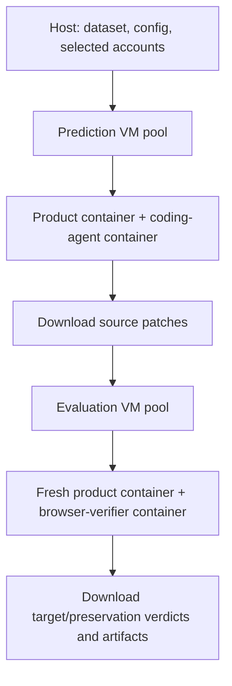

# Design

[README](../README.md) · [Guide](guide.md) · [Agents](agents.md) · [Manual walkthrough](manual-walkthrough.md)

1. [Pipeline](#1-pipeline)
2. [A case](#2-a-case)
3. [Prediction](#3-prediction)
4. [Evaluation](#4-evaluation)
5. [Retries](#5-retries)
6. [Isolation: what is enforced, what is not](#6-isolation-what-is-enforced-what-is-not)
7. [Code map](#7-code-map)

## 1. Pipeline

The host resolves the dataset, selects cases, validates credentials, and partitions each stage into shards. Each shard gets a Modal sandbox using `experimental_options={"vm_runtime": True}`. Its Ubuntu bootstrap image includes Docker, Python, Git, and the repo's `src/runtime/` directory. Docker stays up while that shard processes cases serially.



The `run` command waits for the full prediction stage before starting evaluation. A VM is reused within a stage's shard, but evaluation uses a new pool. The scheduler terminates each VM in a `finally` block. Case startup failures can leave resources inside a still-running shard VM, so resource reuse is not equivalent to a brand-new VM per case.

The runner builds the bootstrap image from local runtime files. Product and agent images are pulled, not built, by the worker. Python/browser tools for the agents come from those published images.

## 2. A case

The dataset row has exactly these fields:

```text
case_id, slug, repo, base_commit, reference_commit,
task_scoped, task_specified, pr, issue, workflows
```

`workflows` is a YAML string containing exactly one target and one preservation workflow with steps. Product image URLs and reference patch bytes are not dataset fields.

With the default registry owner/tag, the worker pulls:

| Purpose | Image |
|---|---|
| Prediction product | `ghcr.io/evigbyen/sweeper-NNN-prediction:alpha` |
| Evaluation product | `ghcr.io/evigbyen/sweeper-NNN:alpha` |
| Coding agent | `ghcr.io/evigbyen/prediction-<harness>:alpha` |
| Browser verifier | `ghcr.io/evigbyen/evaluation-codex:alpha` or `evaluation-browser-use:alpha` |

`dataset.json` records the resolved dataset SHA and file hash. Local `cases.json` includes hidden evaluation metadata and is for the operator. `pred_row()` sends only the ID, repo, base commit, and selected task to the prediction VM. `eval_row()` sends the repo/commits and workflows. Host reference patches are uploaded only when reference evaluation is requested.

## 3. Prediction

The VM pulls the images and fetches the base commit. The clone path attempts a shallow checkout, removes the origin remote, and includes checks/cleanup for extra history. See [worker.py](../src/runtime/worker.py) for fallback behavior; this is not an audit of every file inside a prebuilt image.

The product container mounts the checkout at `/workspace/product`. [product.sh](../src/runtime/product.sh) publishes its port 3000 to VM loopback port 13200 and invokes `product-yarn start`. Readiness means the root URL returns a non-5xx HTTP response, with a default 600-second startup limit. It does not establish that login, JavaScript assets, or the entire app work.

The coding-agent container mounts the same checkout, the task prompt, output directory, and runtime adapters. The default task level is `scoped`; `specified` deliberately discloses the detailed bug description instead. `prediction.prompt_templates` selects [task-templates-non-browser.md](../src/runtime/prompts/task-templates-non-browser.md) by default, or [task-templates-browser.md](../src/runtime/prompts/task-templates-browser.md).

The agent normally runs as the image's `agent` user. `/workspace/task-shell` uses a root-controlled product-container name to execute product commands through Docker. The prompt directs all app commands, HTTP, and browser work through this wrapper. Its command log is `status.shell.txt`.

After the agent exits successfully, the wrapper writes `git diff --binary` to `prediction-<level>.patch`. New source files are included when they are non-empty, at most 1MB, and not runtime junk such as `node_modules`. A nonempty diff is required. A successful agent exit still does not guarantee every intended change was collected. Successful collection packages output artifacts and deletes the case workspace. Failed paths may have only partial artifacts.

## 4. Evaluation

Evaluation clones the base, restores any incoming output when reusing a run, and selects runnable phases:

- `baseline`: base checkout without a patch.
- `reference`: apply the supplied host reference patch.
- `prediction-scoped` / `prediction-specified`: apply the corresponding agent patch.

A missing reference patch skips that phase. Missing prediction inputs are handled by the host before VM execution. No runnable phases means there is no complete evaluation to report.

For each runnable phase, the worker resets the checkout and starts a fresh product container. The verifier runs in a separate container with `--network host` and uses `http://127.0.0.1:13200`. The product checkout is not mounted into the verifier.

Workflows run sequentially. Each creates a browser session and applies any supported localStorage setup through Playwright. Target and preservation share the phase's product instance; separate browser contexts do not reset server-side data between workflows.

The verifier task and JSON format are generated by [browser.py](../src/runtime/browser.py). Codex and browser-use have separate reasoning adapters but share the browser/setup lifecycle. `record = 1` requests video; the templates default to `0`. Recording availability depends on the published browser image and successful browser startup.

Per-workflow `pass`, `fail`, or `uncertain` is aggregated into phase/category result cells. `result.json` at the case root instead reports orchestration status. See [Guide §4](guide.md#4-read-the-results) for the artifact paths and interpretation.

## 5. Retries

| Condition | Automatic handling |
|---|---|
| Workflow exception, invalid JSON, or other `hard_uncertain` result | Up to three attempts for that workflow |
| Valid agent verdict of `uncertain` | Up to three phase attempts, resetting the checkout/product and clearing phase results |
| Valid pass/fail | No retry solely for that verdict; it may be rerun when another workflow triggers a phase retry |
| Product startup, image pull, worker, or VM failure | Report failure; no automatic infrastructure repair |

The distinction between hard uncertainty and agent uncertainty is implemented in [parse_results.py](../src/runtime/parse_results.py). Exhausted uncertainty remains uncertainty, not pass. Complete result cells can include uncertainty.

`skip_failed_tasks = 1` lets a shard proceed after failed/incomplete cases; `0` aborts its remaining cases. It does not raise retry counts. Host `--resume` skips artifacts already considered complete, including completed failures/uncertainties. Use a fresh directory for an independent rerun.

The current layout is not an immutable archive of every attempt: phase cells are cleared/replaced and some log paths can be reused across phase retries. Retain worker logs and copy artifacts before rerunning if a full historical record matters. See [Guide §6](guide.md#6-run-many-cases-resume-recover).

## 6. Isolation: what is enforced, what is not

Prediction receives a restricted payload: no workflows, reference commit, issue/PR metadata, or gold patch. With `level = "scoped"`, it also excludes the specified description. The VM bootstrap copies only `src/runtime/`; it does not mount the host's dataset or patch directory.

With `prediction.egress = true` (default), [pred_net.sh](../src/runtime/pred_net.sh) rejects forwarded traffic from the Docker bridge. Containers use a host-side HTTPS CONNECT proxy whose permitted domains are in [allowlist.txt](../src/runtime/allowlist.txt). Host image pulls and Git fetches occur outside that container restriction. Codex subscription access includes exact `chatgpt.com` and `auth.openai.com` hosts; external GitHub and package registry domains are not allowlisted. Setting `egress = false` disables this protection.

The agent container mounts the Docker socket for the root helper. The non-root agent is intended to access the product only through the helper; the runner does not provide a proof that this is an adversarially secure boundary. Product-container commands can inspect that container's filesystem, including whatever seed scripts, dependencies, and caches the published image contains. Separate prediction image names alone do not prove those contents are free of benchmark clues.

Evaluation intentionally does not apply the prediction network filter. Its browser profile allows localhost, and its prompt forbids outside browsing, but the verifier container uses host networking and has no equivalent internet egress firewall.

The host passes selected subscription credentials to the VM and the relevant agent, not to the product's ordinary environment. Other provider keys present in the host environment can also be forwarded by the runtime's credential mapping. Logs and outputs are evidence for ordinary runs, not a tamper-proof audit trail. Do not infer absence of leakage from a passing verdict alone.

## 7. Code map

| File | Responsibility |
|---|---|
| [scripts/run.py](../scripts/run.py) / [cli.py](../src/cli.py) | CLI, config, stage order |
| [data.py](../src/data.py) | Dataset schema, payload split, phase/completion helpers |
| [runner.py](../src/runner.py) | Shards, account assignment, lifecycle statuses |
| [modal_vm.py](../src/modal_vm.py) | VM image, credential selection, worker execution, downloads |
| [worker.py](../src/runtime/worker.py) | Pull/clone, startup, prediction/evaluation phases, packaging |
| [install.sh](../src/runtime/install.sh) | Docker startup and registry login |
| [product.sh](../src/runtime/product.sh) | Product mount, port, start command, readiness |
| [pred_container.sh](../src/runtime/pred_container.sh) | Coding-agent container mounts/environment |
| [eval_container.sh](../src/runtime/eval_container.sh) | Browser-verifier container mounts/environment |
| [prediction adapters](../src/runtime/harnesses/prediction) | Agent command lines, task-shell, patch collection |
| [browser.py](../src/runtime/browser.py) / [evaluation adapters](../src/runtime/harnesses/evaluation) | Workflow tasks, browser, reasoning, recording |
| [parse_results.py](../src/runtime/parse_results.py) | Structured verdicts, uncertainty, completeness |

For a standalone example using Modal and explicit Docker/agent commands, see the [Manual walkthrough](manual-walkthrough.md).
